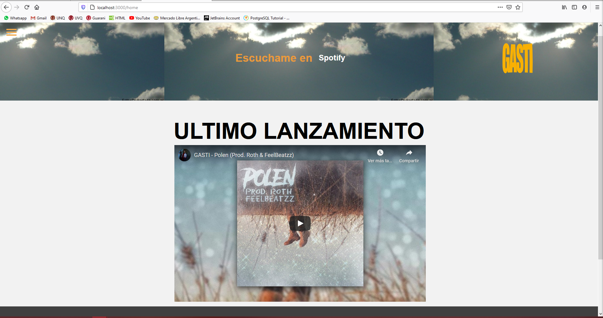
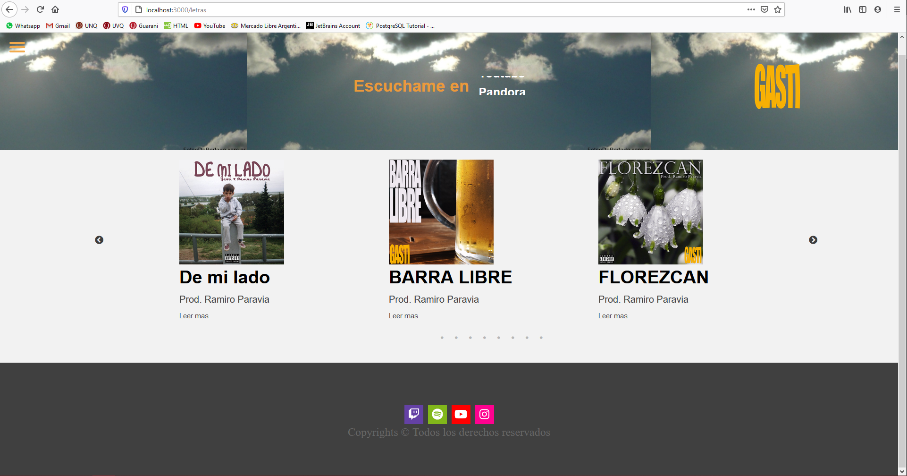
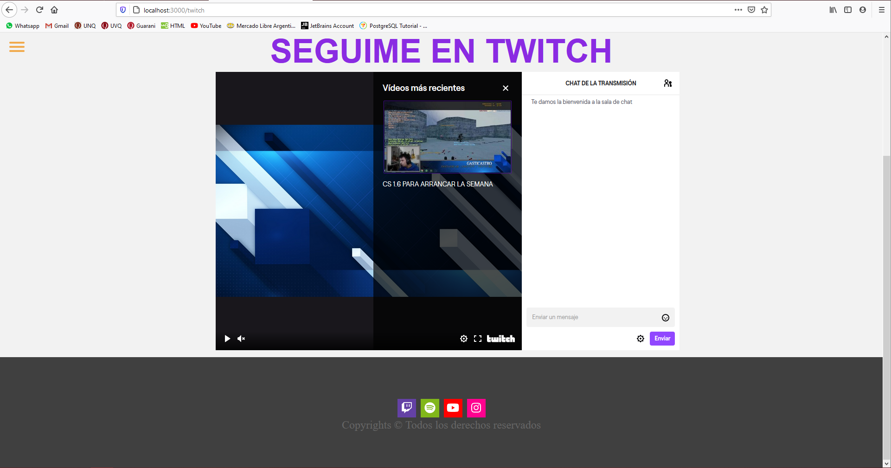

## PAGINA REACT
Esta pagina fue creada por Aldana Castro, siguiendo y ayudada por el curso: https://www.udemy.com/course/master-en-frameworks-javascript-aprende-angular-react-vue-js/, luego seran subidas las paginas de Angular y Vue.

### `npm run dev`

Hace que corra la api en el puerto dado o en el default 3100.
Luego inicializa la app en el localhost:3000
### HOME
Una previsualizacion de como se ve el componente Home.js, tambien se puede apreciar el componente Header

### VIDEOS y MENU
Una vista previa de como se ve el componente Video.js y el componente Navegacion.js

### LETRAS
Una vista previa de como se ve el componente Lyrics.js y el componente Footer.js
La pagina cuenta con la dependencia de react-slick en su formato de carrusel.

### TWITCH
Una previsualizacion de como se ve el componente Twitch.js

#### Informacion

La pagina de Videos y la de Letras contienen un backend donde recopila los videos y/o letras que son subidas, las guarda, y las publica. Este backend fue generado con MongoDB, NodeJS, Express y axios para generar la comunicacion entre el FrontEnd y el BackEnd.
